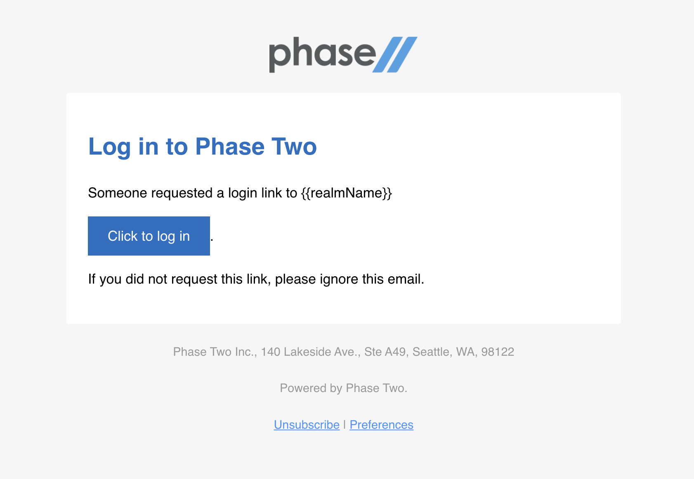

# Email Example

The [email.magic-link.template.html](./email.magic-link.template.html) file is an example of a HTML template that can be applied. Change the content section to apply to any of the other email templates.

Learn more about the customization for emails including template variables in the [docs](https://phasetwo.io/docs/getting-started/email).

